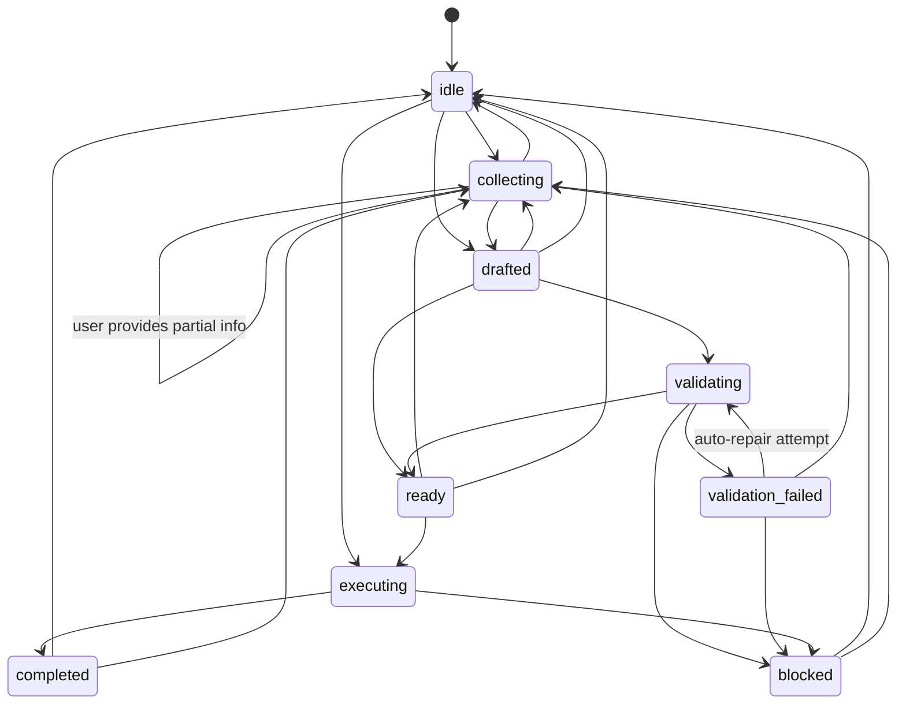
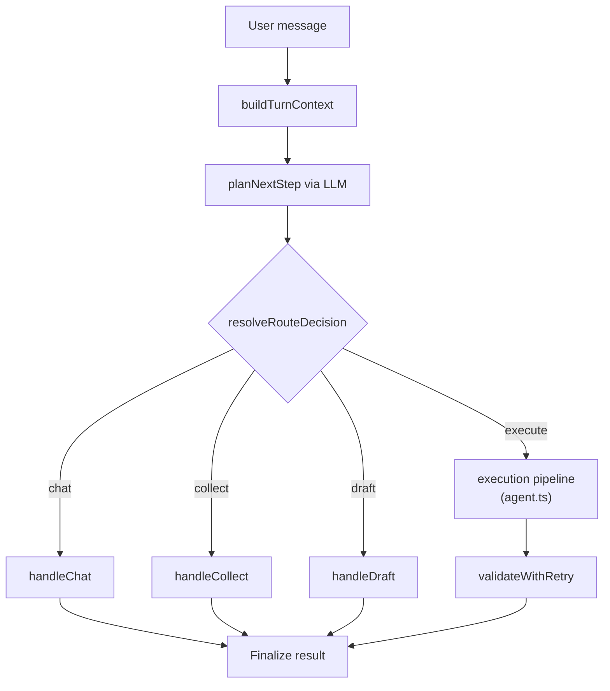

# StructureClaw Agent Architecture

## 1. Purpose

This document defines the target architecture for StructureClaw's agent runtime. It fixes the meaning of `base model`, `skill`, `tool`, `structure-type`, and the staged refactor plan.

Use this file as the canonical design reference when changing agent orchestration, skill loading, or tool registration.

## 2. Core Principle

StructureClaw starts as a normal conversational model.

- If no skills and no tools are loaded, the system behaves like a normal chat model.
- If skills are loaded but tools are not enabled, the system behaves like a structural engineering advisor.
- If both skills and tools are available, the system behaves like an executable engineering agent.

This means the architecture is capability-driven, not mode-driven.

## 3. Runtime Layers

### 3.1 Base Model

The base model is always present.

Responsibilities:

- general dialogue
- plain-language reasoning
- normal follow-up questions
- fallback conversation when no engineering capability is enabled

The base model is the minimum viable system.

### 3.2 Skill Layer

Skills are optional, loadable engineering capability domains.

Responsibilities:

- understand engineering intent
- classify structural requests
- extract and merge draft parameters
- compute missing inputs
- generate clarification questions
- propose defaults
- explain results in engineering language
- guide downstream skill and tool selection

StructureClaw keeps the existing 14 top-level skill domains:

- `structure-type`
- `analysis`
- `code-check`
- `data-input`
- `design`
- `drawing`
- `general`
- `load-boundary`
- `material`
- `report-export`
- `result-postprocess`
- `section`
- `validation`
- `visualization`

These skill domains remain the stable taxonomy of the platform.

### 3.2.1 Domain Taxonomy vs Runtime Participation

Two different layers must be kept distinct:

1. `Domain Taxonomy`

- Defines which capability domains the system recognizes.
- Provides stable terminology, skill organization, extension planning, and the outward-facing capability map of the platform.
- This layer is intentionally stable and should not change frequently with each implementation milestone.

2. `Runtime Participation`

- Describes whether a domain is actually connected to the current agent runtime flow.
- Only domains that participate in runtime are involved in skill discovery, activation, tool authorization, execution, trace attribution, and result write-back.
- This layer describes implementation status and can evolve across versions.

Therefore, inclusion in the taxonomy does not imply that a domain is already wired into the main orchestration path. The domain list in this document should be read as the platform capability map, not as a claim that every domain is already fully executable in the current runtime.

To avoid mixing capability classification with implementation maturity, each domain should also carry a `runtimeStatus` in implementation-oriented documentation:

- `active`
  Participates in main orchestration, activation, authorization, execution, and trace.
- `partial`
  Connected to runtime, but still platform-managed or not yet packaged as a full first-class skill.
- `discoverable`
  Present in the taxonomy with directory, manifest, or registry visibility, but not yet part of the main orchestration flow.
- `reserved`
  Kept as an architectural slot without actual runtime capability in the current version.

The 14 domains define the stable capability taxonomy; the subset that actually participates in the current agent flow is defined by `runtimeStatus`.

### 3.3 Tool Layer

Tools are optional, invokable action interfaces.

Responsibilities:

- perform concrete actions
- validate or transform models
- run analysis or code checks
- generate reports or visualizations
- persist outputs and snapshots

Tools are not capability domains. They are action endpoints that the agent may invoke.

Tools may come from two sources:

- built-in platform tools
- tools provided by an enabled skill

### 3.4 Agent Orchestration Layer

The agent is the coordinator.

Responsibilities:

- read the current conversation and enabled capability set
- select which skills participate in the current turn
- decide whether the next step is reply, ask, or tool invocation
- choose eligible tools from the currently enabled set
- enforce execution guards and sequencing
- produce the final response and artifacts

The agent should be driven by capability availability and user context, not by public `conversation/tool/auto` concepts.

## 4. Skill Definition

A skill is the platform's unit of engineering capability.

In StructureClaw, a skill can be:

- a top-level capability domain, such as `analysis`
- a domain-specific implementation inside that domain, such as `structure-type/beam`

Skills are responsible for understanding and guidance, not raw execution.

The current runtime interfaces in [backend/src/agent-runtime/types.ts](/data1/openclaw/workspace/projects/10structureclaw/dev/structureclaw/backend/src/agent-runtime/types.ts) already reflect this design through `SkillManifest` and `SkillHandler`.

## 5. `structure-type` as the Entry Skill Domain

`structure-type` is the entry skill domain of the engineering workflow.

It is special because it runs before downstream engineering skills.

Responsibilities:

- identify the concrete structure-type skill for the current request
- initialize the draft state
- decide which structural parameters are missing first
- generate the first round of clarification questions
- provide the structural skeleton for downstream skills
- constrain which downstream tools and skills are sensible

Examples of concrete skills inside `structure-type` include:

- `beam`
- `truss`
- `frame`
- `portal-frame`
- `double-span-beam`
- `generic`

`steel-frame` is currently handled as a structure-type key routed through the `frame` skill family, not as a standalone skill manifest.

## 6. Built-in Generic Structure-Type Skill

StructureClaw should always ship with a built-in generic structure-type skill:

- `structure-type/generic`

Role:

- default fallback inside the `structure-type` domain
- enabled by default
- not necessarily the strongest specialist
- able to accept any structural request

Responsibilities:

- catch requests that do not match a stronger specialized structure-type skill
- build a minimum draft state
- ask generic but valid follow-up questions
- provide a minimum engineering path for downstream analysis/report flows

This skill is the minimum engineering capability package, not the base chat model itself.

## 7. Tool Definition

A tool is an invokable action interface available to the agent.

The currently governed canonical tool ids are:

- `convert_model`
- `draft_model`
- `update_model`
- `validate_model`
- `run_analysis`
- `run_code_check`
- `generate_report`

The current runtime now exposes canonical tool ids through the agent protocol and tool-call traces.

Backend-hosted execution endpoints such as `/validate`, `/convert`, `/analyze`, and `/code-check` remain as internal runtime boundaries.

## 8. Skill and Tool Relationship

Skills and tools are both optional.

### 8.1 Skills

Each skill may declare:

- whether it is enabled by default
- which other skills it requires or conflicts with
- which tools it provides
- which tools it allows the agent to use in its context

### 8.2 Tools

Each tool should declare:

- whether it is enabled by default
- whether it is built-in or external
- its input and output contract
- any required guards or prerequisites

### 8.3 Agent Rule

The agent must make decisions only within the currently available tool set.

The currently available tool set is composed of:

- a platform foundation tool allowlist (always-on platform tools)
- domain tools granted by currently enabled and matched skills

It must not assume the full platform capability set is always available.

### 8.4 Layered Tool Authorization Model

To avoid both extremes ("everything is always available" vs. "even platform basics must be skill-granted"), adopt a layered authorization model.

1. Platform Foundation Tools

- Purpose: runtime foundation capabilities such as context I/O, artifact persistence, general conversion, and protocol-level operations.
- Policy: may be always-on via a platform allowlist; no per-skill grant is required.
- Constraint: must not carry domain decisions and must not bypass domain guards to change engineering semantics.

2. Domain Decision Tools

- Purpose: tools that change engineering semantics or trigger engineering execution chains, such as drafting, model updates, analysis, design, code checks, and reporting.
- Policy: must be granted by matched skills and current capability state before invocation.
- Constraint: each invocation must pass guard checks (prerequisites, sequencing, dependencies).

3. Agent Selection Rule

- Agent tool selection scope = platform foundation allowlist + domain tools granted by current skills.
- If a required domain tool is not granted by current skills, the agent must return blocked or continue clarification; it must not implicitly allow execution.
- Platform foundation tools cannot substitute domain tools for skill-led decision actions.

### 8.5 Built-in vs External Capability Quadrants

To align platform governance with ecosystem extensibility, both skills and tools are split into built-in and external categories.

1. Skill categories

- Built-in skills: capabilities shipped by the platform and directly routable by the agent orchestrator.
- External skills: plugin or third-party capabilities registered by manifest and enabled by policy.

2. Tool categories

- Built-in tools: platform-owned foundation action interfaces. The currently active built-in foundation tool is `convert_model`.
- External tools: action interfaces provided by external skills or extensions.

3. Authorization rules

- Built-in tools do not require skill grants, but they must not take over domain decision-making.
- External tools must be explicitly granted by currently matched skills before invocation.
- External tool calls must also pass dependency and sequencing guards.
- User manual toggles (skill/tool enable/disable) have the highest priority and override automatic activation, platform default allowlists, and policy suggestions.

4. Available tool set

For each turn, the available tool set is defined as:

- platform foundation built-in tools (currently `convert_model`, still constrained by platform guards)
- external tools explicitly granted by currently active skills

The final usable set must be intersected with the user-enabled set; any skill or tool manually disabled by the user must become immediately unavailable.

The orchestrator must not invoke tools outside this set.

5. Audit requirements

Every tool invocation should record:

- tool source (built-in or external)
- for external tools, the granting skill id
- if blocked, a stable blocked-reason code

### 8.6 Invocation Matrix

To prevent ambiguity, the invocation matrix is fixed as follows:

- Built-in skill -> built-in tool: allowed
- Built-in skill -> external tool: allowed only when the external tool is granted by the currently active skills
- External skill -> built-in tool: allowed
- External skill -> external tool: allowed only when explicitly granted by that external skill or the current active skill set

Any implicit allow path for ungranted external tools is prohibited.

### 8.7 Current-Phase Operating Constraints (2026-04)

To avoid confusion between the target architecture and the current implementation phase, the following constraints apply now:

1. Current skill status

- All currently shipped skills are treated as built-in skills.
- External skills refer to SkillHub packages; this channel is reserved and not yet enabled for production runtime.

2. Current tool status

- In the current production governance model, every canonical tool except `convert_model` is managed as an external tool.
- `convert_model` is the active platform foundation built-in tool; all other canonical tools must be skill-granted before invocation.

3. Effective authorization rule for this phase

- During this phase, tool invocation must pass current-skill grants and guard checks.
- Any skill or tool manually disabled by the user must become immediately unavailable.

4. Priority rule

- User manual toggles (skill/tool enable/disable) have the highest priority.
- Manual toggles must override automatic activation, default sets, and policy suggestions.

## 9. Full Structural Engineering Workflow

The intended end-to-end workflow is:

1. User sends a message.
2. Agent loads the current conversation, session state, and enabled capability set.
3. `structure-type` runs first and selects the concrete structure-type skill.
4. Draft state is created or updated.
5. Downstream skills participate as needed:
   - `data-input`
   - `load-boundary`
   - `material`
   - `section`
   - `analysis`
   - `design`
   - `code-check`
   - `validation`
   - `result-postprocess`
   - `report-export`
   - `visualization`
   - `drawing`
   - `general`
6. The agent decides the next step:
   - reply
   - ask
   - tool invocation
7. If a tool is invoked, the agent chooses from the currently enabled tool set.
8. Guards validate that the tool call is legal and well-ordered.
9. The tool executes and produces artifacts.
10. Postprocessing, reporting, visualization, and persistence happen as needed.

## 10. Current Code Mapping

The agent orchestration layer is decomposed into the following modules.

### 10.1 Public Surface

- [backend/src/api/chat.ts](backend/src/api/chat.ts)
  Public HTTP endpoints for chat. Accepts user messages and delegates to the agent service.
- [backend/src/services/agent.ts](backend/src/services/agent.ts)
  `AgentService` class: public API (`run`, `runStream`), persistence helpers, execution pipeline, and orchestration shell. Delegates routing, planning, result building, session management, and validation to the modules below.

### 10.2 Agent Orchestration Modules

- [backend/src/services/agent-context.ts](backend/src/services/agent-context.ts)
  Defines `TurnContext` (unified per-turn parameter object), `HandlerDeps` (dependency-injection interface for handlers), `RouteDecision`, and the `buildTurnContext()` factory.
- [backend/src/services/agent-router.ts](backend/src/services/agent-router.ts)
  Planner and routing logic extracted from `AgentService`: `planNextStep`, `planNextStepWithLlm`, `buildPlannerContextSnapshot`, `parsePlannerResponse`, `repairPlannerResponse`, `resolveInteractivePlanKind`, `extractJsonObject`.
- [backend/src/services/agent-result.ts](backend/src/services/agent-result.ts)
  Result builders and renderers extracted from `AgentService`: `buildMetrics`, `buildInteractionQuestion`, `buildToolInteraction`, `buildRecommendedNextStep`, `buildGenericModelingIntro`, `buildChatModeResponse`, `renderSummary`.
- [backend/src/services/agent-session.ts](backend/src/services/agent-session.ts)
  Session state machine and Redis persistence: `SessionState` type, `transitionSession` (enforces allowed transitions), `getSessionState`, `buildInteractionSessionKey`, `getInteractionSession`, `setInteractionSession`, `clearInteractionSession`.
- [backend/src/services/agent-validation.ts](backend/src/services/agent-validation.ts)
  Model validation with LLM auto-repair: `validateWithRetry` (wraps `executeValidateModelStep` with up to 2 repair attempts) and `tryRepairModel` (sends model + validation error to LLM for JSON-level repair).

### 10.3 Route Handlers

Each handler corresponds to a distinct conversation path dispatched by the router.

- [backend/src/services/agent-handlers/chat.ts](backend/src/services/agent-handlers/chat.ts)
  `handleChat` -- plain conversational reply path. No skill extraction or model building.
- [backend/src/services/agent-handlers/collect.ts](backend/src/services/agent-handlers/collect.ts)
  `handleCollect` -- lightweight parameter extraction path for the "ask" decision. Calls `extractDraftParameters` only; explicitly skips the expensive `tryBuildGenericModelWithLlm` model generation.
- [backend/src/services/agent-handlers/draft.ts](backend/src/services/agent-handlers/draft.ts)
  `handleDraft` -- full model drafting path. Calls the complete `textToModelDraft` pipeline including model building when sufficient parameters are available.
- [backend/src/services/agent-handlers/execute.ts](backend/src/services/agent-handlers/execute.ts)
  `handleExecute` -- stub. The execution pipeline (model preparation, analysis, code check, report generation) remains in `AgentService` and will be extracted in a future pass.
- [backend/src/services/agent-handlers/index.ts](backend/src/services/agent-handlers/index.ts)
  Barrel re-export for all handlers.

### 10.4 Skill Runtime

- [backend/src/agent-runtime/types.ts](backend/src/agent-runtime/types.ts)
  Skill domains, manifests, handlers, draft state, runtime types, and `DraftParameterExtractionResult`.
- [backend/src/agent-runtime/index.ts](backend/src/agent-runtime/index.ts)
  `AgentSkillRuntime` class: skill discovery, structure-type detection, and draft handling. Exposes `extractDraftParameters` (parameter extraction without model building), `buildModelFromDraft` (model construction from extracted parameters), and `textToModelDraft` (composed pipeline for backward compatibility).

### 10.5 Conversation Persistence

- [backend/src/services/conversation.ts](backend/src/services/conversation.ts)
  Conversation CRUD and snapshot persistence.

## 10A. Multi-Round Conversation Architecture

### 10A.1 Session State Machine

Each conversation maintains an `InteractionSession` stored in Redis. The session carries a `state` field that tracks the conversation's position in the multi-round workflow.

Defined states:

- `idle` -- no active engineering interaction; starting point for new conversations.
- `collecting` -- gathering parameters from the user via follow-up questions.
- `drafted` -- a structural model draft has been produced.
- `validating` -- the model is being validated.
- `validation_failed` -- validation failed; the system may attempt auto-repair.
- `ready` -- the model passed validation and is ready for execution.
- `executing` -- the execution pipeline (analysis, code check, report) is running.
- `completed` -- execution finished successfully.
- `blocked` -- the system cannot proceed and needs user intervention.

Allowed transitions are enforced by `transitionSession` in `agent-session.ts`. Sessions without a `state` field (created before this mechanism) default to `idle`.

### 10A.2 Route-Based Dispatch

Each incoming user message follows a fixed dispatch sequence:

1. **Build context**: `buildTurnContext` assembles the `TurnContext` object containing the message, locale, session state, active skills, and available tools.
2. **Plan next step**: `planNextStep` calls the LLM planner to decide the best next action (`reply`, `ask`, or `tool_call`).
3. **Resolve route**: the planner output is mapped to a `RouteDecision`:
   - `kind: 'reply'` with `replyMode: 'plain'` maps to **chat**
   - `kind: 'ask'` maps to **collect**
   - `kind: 'reply'` with `replyMode: 'structured'` maps to **draft**
   - `kind: 'tool_call'` maps to **execute**
4. **Dispatch to handler**: the corresponding handler function runs.

### 10A.3 Collect vs Draft Optimization

A key performance optimization distinguishes the `collect` path from the `draft` path.

When the planner decides to ask the user for more information, the system only needs to know which parameters are missing -- it does not need a complete structural model. The `collect` handler calls `extractDraftParameters` (which runs skill detection and parameter extraction) but explicitly skips `tryBuildGenericModelWithLlm` (an expensive LLM call that generates a full StructureModel JSON).

This eliminates ~40 seconds of unnecessary model generation on the "ask" path while preserving the same interaction contract (tool call traces, question formatting, session updates).

When sufficient parameters are available and the planner decides to reply with a structured result, the `draft` handler runs the full `textToModelDraft` pipeline including model building.

### 10A.4 Validation with Auto-Repair

When a structural model is generated during the current turn, the validation step uses `validateWithRetry` instead of a single pass:

1. Run `executeValidateModelStep` on the model.
2. If validation fails and the model was LLM-generated in this turn, call `tryRepairModel` -- an LLM call that receives the original model JSON and the validation error, and returns a repaired JSON.
3. Re-validate the repaired model.
4. Repeat up to `maxRetries` (default 2) times.
5. If all repair attempts fail, transition the session to `blocked` and return a clarification response to the user.

This mechanism recovers from common LLM generation errors (missing fields, type mismatches, invalid enum values) without requiring the user to re-enter information.

## 11. Refactor Direction

The target refactor is:

- public API becomes a single chat-first agent interface
- `structure-type` becomes the stable first engineering step
- `structure-type/generic` becomes the default built-in fallback skill
- skills and tools become explicitly enableable or disableable
- new skills may introduce new tools
- public `mode` concepts are removed from product-facing interaction
- orchestration becomes capability-driven instead of mode-driven

### Current Implementation Status (2026-04)

The runtime has already aligned key orchestration behavior with the target design:

- internal planning directives are now simplified to `auto` and `force_tool`
- planner output no longer decides concrete `toolId`; concrete tool selection is runtime-owned and skill-driven
- `force_tool` bypasses planner branching and enters the skill-first execution path
- service entrypoints are now consolidated to `run` and `runStream`; interactive/tool-call compatibility wrappers are removed
- in skill-enabled flows, drafting tools are no longer globally default-enabled and must come from skill capability grants; the core execution pipeline tools remain platform-provided

### Multi-Round Architecture Status (2026-04)

The following orchestration improvements have been completed:

- **Route-based dispatch** is live for chat, collect, and draft paths. The execute path remains in `AgentService` and will be extracted in a future pass.
- **Session state machine** is live with explicit `SessionState` transitions enforced by `transitionSession`. Old sessions without a `state` field are backward-compatible (default to `idle`).
- **Collect-only parameter extraction** eliminates wasteful model generation on the "ask" path, saving ~40 seconds per round when the planner decides to gather more information.
- **Validation with auto-repair** is live. `validateWithRetry` attempts up to 2 LLM-driven repairs before blocking.
- **File decomposition** has extracted planner logic, result builders, session management, and validation into separate modules. `agent.ts` has been reduced from ~4856 to ~4500 lines. Further slimming to the target ~800 lines depends on extracting the execution pipeline into `agent-handlers/execute.ts`.

## 12. Staged Refactor Plan

### Stage 1: Freeze Vocabulary and Contracts

- keep the 14 top-level skill domains unchanged
- define `structure-type` as the entry skill domain
- define `structure-type/generic` as the built-in fallback skill
- add documentation-backed rules for optional skills and optional tools

### Stage 2: Add Skill and Tool Registration Metadata

- extend skill manifests with enablement and tool-binding metadata
- introduce a tool manifest model for built-in and external tools
- make the runtime compute the active capability set per request or session

### Stage 3: Make `structure-type` the Stable First Step

- route every engineering request through `structure-type`
- prefer specialized structure-type skills when matched
- fallback to `structure-type/generic` when no stronger match exists

### Stage 4: Convert Orchestration to Capability-Driven Planning

- stop treating public run mode as the primary routing abstraction
- plan the next step from current context and active capability set
- keep the result space simple: `reply`, `ask`, or tool invocation

### Stage 5: Move Toward Dynamic Tool Discovery

- keep core built-in tools available
- allow skills to register their own tools
- allow sessions or projects to enable or disable both skills and tools

### Stage 6: Simplify Public Product Surface

- public chat endpoints stop exposing explicit run mode
- frontend sends a single chat request shape
- internal services still keep enough state for debugging and regression tests

### Stage 7: Rewrite Tests Around Capability Sets

- validate base chat behavior with zero skills and zero tools
- validate skilled-chat behavior with skills but no tools
- validate full agent behavior with both skills and tools
- validate `structure-type/generic` fallback behavior

## 13. Target Outcomes

After the refactor:

- the system can operate as plain chat
- the system can operate as an engineering advisor without execution
- the system can operate as a full engineering agent
- the 14-skill taxonomy remains stable
- `structure-type` reliably guides downstream engineering behavior
- skills and tools become modular and configurable
