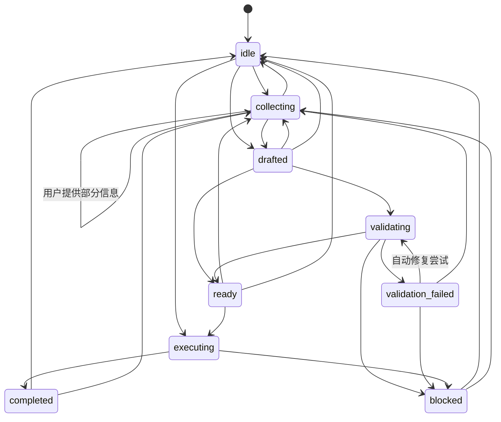
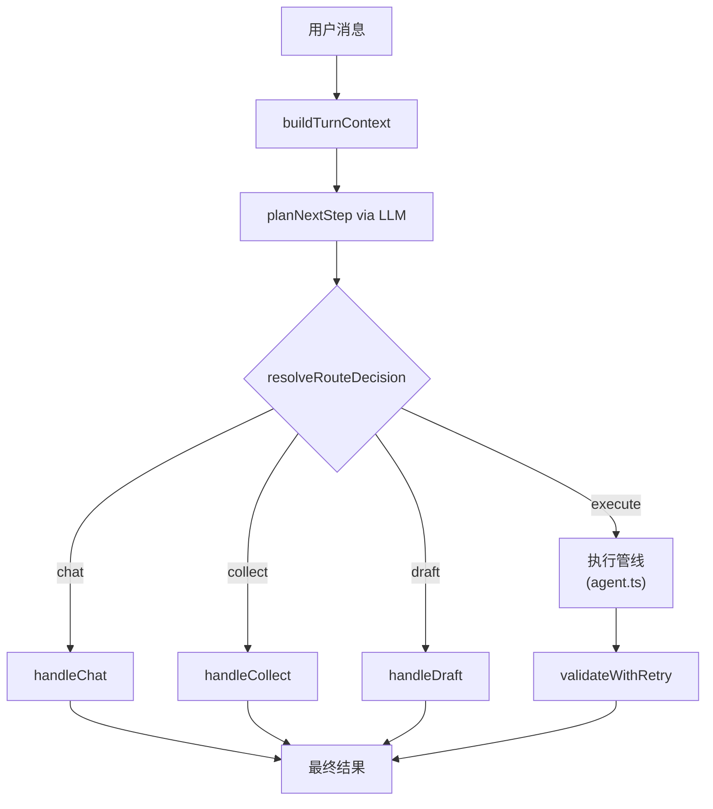

# StructureClaw Agent 架构

## 1. 文档定位

本文档用于定义 StructureClaw Agent Runtime 的目标架构，明确 `base model`、`skill`、`tool`、`structure-type` 以及后续分阶段重构计划。

当需要修改 Agent 编排、Skill 加载或 Tool 注册机制时，请以本文档作为统一设计依据。

## 2. 核心原则

StructureClaw 的起点是一个普通对话模型。

- 当没有加载任何 skill，也没有启用任何 tool 时，系统表现为普通聊天模型。
- 当加载了 skill 但没有启用 tool 时，系统表现为结构工程顾问。
- 当同时存在 skill 与 tool 时，系统表现为可执行的工程 agent。

因此，这套架构应当是“能力集驱动”，而不是“模式驱动”。

## 3. 运行时分层

### 3.1 Base Model

Base Model 永远存在。

职责：

- 普通对话
- 自然语言推理
- 常规追问
- 在未启用工程能力时提供降级对话

它是系统的最小可运行形态。

### 3.2 Skill Layer

Skill 是可选加载的工程专业能力层。

职责：

- 理解工程意图
- 识别结构请求类型
- 抽取并合并建模草稿参数
- 计算缺失输入
- 生成追问
- 提供默认值建议
- 用工程语言解释结果
- 引导后续 skill 和 tool 的选择

StructureClaw 保留现有 14 类顶层 skill 域：

- `structure-type`
- `analysis`
- `code-check`
- `data-input`
- `design`
- `drawing`
- `general`
- `load-boundary`
- `material`
- `report-export`
- `result-postprocess`
- `section`
- `validation`
- `visualization`

这 14 类 skill 域继续作为平台稳定的能力分类体系。

### 3.2.1 Domain Taxonomy 与 Runtime Participation

需要明确区分两个层面：

1. `Domain Taxonomy`

- 用于定义系统承认哪些能力域存在。
- 作用是统一术语、组织 skill、规划扩展方向，并对外描述平台能力版图。
- 该层是稳定的能力分类体系，通常不随单个版本的实现进度频繁变化。

2. `Runtime Participation`

- 用于描述某个 domain 在当前版本中是否已经进入 agent 运行时主流程。
- 只有进入 runtime participation 的 domain，才会参与 skill 发现、激活、tool 授权、执行、trace 归因与结果回写。
- 该层描述的是实现态，会随着版本演进逐步变化。

因此，某个 domain 被纳入 taxonomy，并不意味着它已经接入当前主编排；文档中的 domain 列表应理解为平台能力地图，而不是“当前全部已落地执行域清单”。

为避免把能力分类与实现成熟度混为一谈，每个 domain 在实现说明中应额外标记 `runtimeStatus`：

- `active`
  已接入主编排，参与激活、授权、执行与 trace。
- `partial`
  已接入 runtime，但仍由平台托管，或尚未形成完整的一等 skill 包。
- `discoverable`
  已纳入 taxonomy，具备目录、清单或注册信息，但尚未参与主编排。
- `reserved`
  仅保留架构位点，当前未提供实际运行时能力。

架构中的 14 个 domain 是稳定的能力分类体系；当前版本真正参与 agent 主流程的 domain 子集，由 `runtimeStatus` 定义。

### 3.3 Tool Layer

Tool 是可选启用的动作执行层。

职责：

- 执行具体动作
- 校验或转换模型
- 执行分析或规范校核
- 生成报告或可视化
- 持久化结果与快照

Tool 不是能力域，而是 agent 可调用的动作接口。

Tool 可以来自两类来源：

- 平台内置 tool
- 某个已启用 skill 提供的扩展 tool

### 3.4 Agent Orchestration Layer

Agent 是总控层。

职责：

- 读取当前会话和当前启用能力集
- 决定本轮要使用哪些 skill
- 决定下一步是回复、追问还是调用 tool
- 从当前启用 tool 集中选择合法工具
- 负责执行前护栏和调用顺序
- 汇总结果并产出最终响应

Agent 应由“当前能力集 + 上下文”驱动，而不是由公开的 `conversation/tool/auto` 概念驱动。

## 4. Skill 的正式定义

Skill 是平台的工程能力单位。

在 StructureClaw 中，skill 可以是：

- 一级能力域，例如 `analysis`
- 某个能力域内的具体技能实现，例如 `structure-type/beam`

Skill 的职责是理解、补参、建议和解释，而不是直接执行动作。

[backend/src/agent-runtime/types.ts](/data1/openclaw/workspace/projects/10structureclaw/dev/structureclaw/backend/src/agent-runtime/types.ts) 中的 `SkillManifest` 与 `SkillHandler` 已经体现了这套设计。

## 5. `structure-type` 作为入口技能域

`structure-type` 是整条工程流程的入口技能域。

它的特殊性在于：任何工程请求都应优先经过它。

职责：

- 识别当前请求应命中的具体结构类型技能
- 初始化 draft state
- 决定优先缺少哪些结构参数
- 生成第一轮追问
- 为后续 skill 提供结构骨架
- 约束后续哪些 tool 和 skill 合理可用

`structure-type` 域下的具体技能包括：

- `beam`
- `truss`
- `frame`
- `portal-frame`
- `double-span-beam`
- `generic`

其中 `steel-frame` 当前作为 `frame` 技能族下的结构类型 key 兼容处理，不是单独的独立 skill manifest。

## 6. 默认内置通用结构类型技能

StructureClaw 应默认内置一个通用的结构类型技能：

- `structure-type/generic`

定位：

- `structure-type` 域内的默认兜底 skill
- 默认启用
- 能力不一定最强
- 但任何结构请求都能接住

职责：

- 当没有更强的专用 structure-type skill 命中时接管
- 生成最小 draft state
- 生成通用但有效的追问
- 为后续分析、报告等流程提供最小工程骨架

这个 skill 不是系统本体，而是“最小工程能力包”。

## 7. Tool 的正式定义

Tool 是 agent 可调用的动作接口。

当前正式暴露并受治理的 canonical tool id 包括：

- `convert_model`
- `draft_model`
- `update_model`
- `validate_model`
- `run_analysis`
- `run_code_check`
- `generate_report`

当前运行时已经在 agent 协议与 tool trace 中统一暴露 canonical tool id。

底层 backend 执行端点，如 `/validate`、`/convert`、`/analyze`、`/code-check`，仍作为内部运行时边界保留。

## 8. Skill 与 Tool 的关系

Skill 与 Tool 都是可选的。

### 8.1 Skill

每个 skill 可声明：

- 是否默认启用
- 依赖哪些其它 skill
- 与哪些 skill 冲突
- 自己提供哪些 tool
- 自己允许 agent 使用哪些 tool

### 8.2 Tool

每个 tool 应声明：

- 是否默认启用
- 来源是平台内置还是 skill 提供
- 输入输出契约
- 所需前置条件和执行护栏

### 8.3 Agent 规则

Agent 只能在“当前可用 tool 集”内做决策。

其中“当前可用 tool 集”由两部分组成：

- 平台基础工具白名单（平台常开）
- 当前启用 skill 授权的领域工具

它不能默认假设整个平台的所有能力始终可用。

### 8.4 工具分层授权模型

为避免“全量工具默认可用”与“过度约束平台基础能力”两种极端，采用分层授权模型。

1. 平台基础工具（Platform Foundation Tools）

- 用途：运行时基础能力，例如上下文读写、工件持久化、通用转换与协议层能力。
- 策略：可由平台白名单常开，不要求每个 skill 显式授权。
- 约束：不得承载领域决策，不应绕过领域护栏直接改变工程语义。

2. 领域决策工具（Domain Decision Tools）

- 用途：会改变工程语义或触发工程执行链，例如建模、模型更新、分析、设计、规范校核、报告生成。
- 策略：必须由已命中的 skill 与当前能力状态共同授权后方可调用。
- 约束：调用前必须通过 guard（前置条件、顺序、依赖）检查。

3. Agent 选择规则

- Agent 的工具选择范围 = 平台基础工具白名单 + 当前 skill 授权的领域工具。
- 当领域工具未被当前 skill 授权时，Agent 必须返回 blocked 或继续追问，不得隐式放行。
- 平台基础工具不能替代领域工具完成本应由 skill 主导的决策动作。

### 8.5 内置与外接能力四象限

为统一平台治理与生态扩展，skill 和 tool 都分为内置与外接两类。

1. Skill 分类

- 内置 skill：平台内随版本发布的能力，默认可被 agent 编排器感知与路由。
- 外接 skill：插件或第三方能力，通过 manifest 注册并由平台按策略启用。

2. Tool 分类

- 内置 tool：平台基础动作接口。当前正式内置并常开的基础工具为 `convert_model`。
- 外接 tool：由外接 skill 或外部扩展提供的动作接口。

3. 权限原则

- 内置 tool 不要求 skill 授权，但不得承担领域决策。
- 外接 tool 必须由当前已命中的 skill 显式授权后方可调用。
- 外接 tool 的调用同时需要通过依赖与顺序护栏校验。
- 用户手动开关（skill/tool enable/disable）优先级最高，覆盖自动激活、平台默认白名单与策略建议。

4. 可用工具集合

当前轮次可用工具集合定义为：

- 平台基础内置 tool（当前为 `convert_model`，受平台护栏约束）
- 当前激活 skill 显式授权的外接 tool

最终可用集合需再与“用户手动开启集合”求交集；被用户手动关闭的 skill 或 tool 必须立即失效。

编排器不得调用未在上述集合中的工具。

5. 审计要求

每次 tool 调用应记录：

- tool 来源（内置或外接）
- 若为外接 tool，则记录授权的 skill id
- 若被阻断，则记录阻断原因码

### 8.6 调用矩阵

为避免歧义，调用矩阵固定如下：

- 内置 skill -> 内置 tool：允许
- 内置 skill -> 外接 tool：仅在外接 tool 已被当前激活 skill 授权时允许
- 外接 skill -> 内置 tool：允许
- 外接 skill -> 外接 tool：仅在该外接 skill 或当前激活 skill 集显式授权时允许

禁止任何“未授权外接 tool 隐式放行”的路径。

### 8.7 当前阶段落地约束（2026-04）

为避免“目标态设计”与“当前实现态”混淆，当前阶段采用以下明确约束：

1. skill 现状

- 当前所有已上线 skill 均视为内置 skill。
- 外接 skill 指 SkillHub 中的技能包；该通道当前预留，尚未投入生产运行。

2. tool 现状

- 当前线上治理口径中，除 `convert_model` 外，其余 canonical tool 均按外接 tool 管理。
- `convert_model` 作为平台基础内置 tool，可在平台护栏下直接调用；其它 tool 必须由 skill 授权。

3. 当前有效授权规则

- 当前阶段中，tool 调用必须经过当前激活 skill 的授权与护栏校验。
- 对于用户手动关闭的 skill 或 tool，必须立即失效并禁止调用。

4. 优先级规则

- 用户手动开关（skill/tool enable/disable）优先级最高。
- 手动开关必须覆盖自动激活、默认集合与策略建议。

## 9. 结构设计分析全过程

目标工作流如下：

1. 用户发送消息。
2. Agent 读取当前会话、session state 与当前启用能力集。
3. 先进入 `structure-type` 技能域并选定具体结构类型技能。
4. 创建或更新 draft state。
5. 按需激活后续 skill 域：
   - `data-input`
   - `load-boundary`
   - `material`
   - `section`
   - `analysis`
   - `design`
   - `code-check`
   - `validation`
   - `result-postprocess`
   - `report-export`
   - `visualization`
   - `drawing`
   - `general`
6. Agent 决定下一步：
   - 直接回复
   - 继续追问
   - 调用 tool
7. 如果调用 tool，则必须从当前启用的 tool 集合中选择。
8. 执行前由 guard 检查调用是否合法、顺序是否正确。
9. tool 执行并产出结果工件。
10. 根据需要完成后处理、报告、可视化与持久化。

## 10. 当前代码职责映射

Agent 编排层已拆分为以下模块。

### 10.1 对外接口

- [backend/src/api/chat.ts](backend/src/api/chat.ts)
  对外统一 HTTP 聊天入口，接收用户消息并委托 agent 服务处理。
- [backend/src/services/agent.ts](backend/src/services/agent.ts)
  `AgentService` 类：对外 API（`run`、`runStream`）、持久化、执行管线与编排壳。路由、规划、结果构建、会话管理与校验均委托至下列模块。

### 10.2 Agent 编排模块

- [backend/src/services/agent-context.ts](backend/src/services/agent-context.ts)
  定义 `TurnContext`（每轮统一参数对象）、`HandlerDeps`（handler 依赖注入接口）、`RouteDecision`，以及 `buildTurnContext()` 工厂函数。
- [backend/src/services/agent-router.ts](backend/src/services/agent-router.ts)
  从 `AgentService` 中提取的规划与路由逻辑：`planNextStep`、`planNextStepWithLlm`、`buildPlannerContextSnapshot`、`parsePlannerResponse`、`repairPlannerResponse`、`resolveInteractivePlanKind`、`extractJsonObject`。
- [backend/src/services/agent-result.ts](backend/src/services/agent-result.ts)
  从 `AgentService` 中提取的结果构建与渲染函数：`buildMetrics`、`buildInteractionQuestion`、`buildToolInteraction`、`buildRecommendedNextStep`、`buildGenericModelingIntro`、`buildChatModeResponse`、`renderSummary`。
- [backend/src/services/agent-session.ts](backend/src/services/agent-session.ts)
  会话状态机与 Redis 持久化：`SessionState` 类型、`transitionSession`（强制合法转换）、`getSessionState`、`buildInteractionSessionKey`、`getInteractionSession`、`setInteractionSession`、`clearInteractionSession`。
- [backend/src/services/agent-validation.ts](backend/src/services/agent-validation.ts)
  带 LLM 自动修复的模型校验：`validateWithRetry`（包装 `executeValidateModelStep`，最多尝试 2 次修复）与 `tryRepairModel`（将模型 JSON 及校验错误发送给 LLM 进行 JSON 级别修复）。

### 10.3 路由 Handler

每个 handler 对应由 router 分发的一条独立会话路径。

- [backend/src/services/agent-handlers/chat.ts](backend/src/services/agent-handlers/chat.ts)
  `handleChat` —— 纯对话回复路径，不触发 skill 提取或建模。
- [backend/src/services/agent-handlers/collect.ts](backend/src/services/agent-handlers/collect.ts)
  `handleCollect` —— 轻量参数提取路径，对应 planner 的"追问"决策。仅调用 `extractDraftParameters`，显式跳过耗时的 `tryBuildGenericModelWithLlm` 模型生成。
- [backend/src/services/agent-handlers/draft.ts](backend/src/services/agent-handlers/draft.ts)
  `handleDraft` —— 完整建模路径。当参数充足时，调用完整的 `textToModelDraft` 管线（含模型构建）。
- [backend/src/services/agent-handlers/execute.ts](backend/src/services/agent-handlers/execute.ts)
  `handleExecute` —— 占位桩。执行管线（模型准备、分析、规范校核、报告生成）仍在 `AgentService` 中，将在后续阶段提取。
- [backend/src/services/agent-handlers/index.ts](backend/src/services/agent-handlers/index.ts)
  所有 handler 的统一导出桶文件。

### 10.4 Skill Runtime

- [backend/src/agent-runtime/types.ts](backend/src/agent-runtime/types.ts)
  skill 域、manifest、handler、draft state、runtime 类型，以及 `DraftParameterExtractionResult`。
- [backend/src/agent-runtime/index.ts](backend/src/agent-runtime/index.ts)
  `AgentSkillRuntime` 类：skill 发现、structure-type 检测与 draft 处理。对外暴露 `extractDraftParameters`（仅参数提取，不构建模型）、`buildModelFromDraft`（从提取结果构建模型）、`textToModelDraft`（组合管线，向后兼容）。

### 10.5 会话持久化

- [backend/src/services/conversation.ts](backend/src/services/conversation.ts)
  会话 CRUD 与 snapshot 持久化。

## 10A. 多轮对话架构

### 10A.1 会话状态机

每个对话在 Redis 中维护一个 `InteractionSession`。会话携带 `state` 字段，用于跟踪当前在多轮流程中的位置。

已定义的状态：

- `idle` —— 无活跃工程交互；新对话的起始状态。
- `collecting` —— 正在通过追问向用户收集参数。
- `drafted` —— 已产出结构模型草稿。
- `validating` —— 模型正在校验中。
- `validation_failed` —— 校验失败；系统可能尝试自动修复。
- `ready` —— 模型已通过校验，可以进入执行。
- `executing` —— 执行管线（分析、规范校核、报告）正在运行。
- `completed` —— 执行成功完成。
- `blocked` —— 系统无法继续，需要用户干预。

合法转换由 `agent-session.ts` 中的 `transitionSession` 强制执行。未携带 `state` 字段的旧会话（在此机制引入前创建）默认为 `idle`。

### 10A.2 基于路由的分发

每条用户消息遵循固定的分发流程：

1. **构建上下文**：`buildTurnContext` 组装 `TurnContext` 对象，包含消息、locale、会话状态、活跃 skill 与可用 tool。
2. **规划下一步**：`planNextStep` 调用 LLM planner 决定最优动作（`reply`、`ask` 或 `tool_call`）。
3. **解析路由**：planner 输出映射为 `RouteDecision`：
   - `kind: 'reply'` 且 `replyMode: 'plain'` 映射为 **chat**
   - `kind: 'ask'` 映射为 **collect**
   - `kind: 'reply'` 且 `replyMode: 'structured'` 映射为 **draft**
   - `kind: 'tool_call'` 映射为 **execute**
4. **分发至 handler**：执行对应的 handler 函数。

### 10A.3 Collect 与 Draft 路径优化

一项关键性能优化将 `collect` 路径与 `draft` 路径区分开来。

当 planner 决定向用户追问更多信息时，系统只需要知道哪些参数缺失——不需要构建完整的结构模型。`collect` handler 调用 `extractDraftParameters`（执行 skill 检测和参数提取），但显式跳过 `tryBuildGenericModelWithLlm`（一次耗时的 LLM 调用，用于生成完整的 StructureModel JSON）。

这在"追问"路径上消除了约 40 秒的不必要模型生成，同时保持了相同的交互契约（tool call trace、问题格式、会话更新）。

当参数充足且 planner 决定以结构化结果回复时，`draft` handler 运行完整的 `textToModelDraft` 管线（含模型构建）。

### 10A.4 带自动修复的校验

当当前轮次生成了结构模型时，校验步骤使用 `validateWithRetry` 代替单次校验：

1. 对模型执行 `executeValidateModelStep`。
2. 若校验失败且模型是本轮 LLM 生成的，则调用 `tryRepairModel` —— 一次 LLM 调用，接收原始模型 JSON 和校验错误，返回修复后的 JSON。
3. 重新校验修复后的模型。
4. 最多重复 `maxRetries`（默认 2）次。
5. 若所有修复尝试均失败，将会话转换为 `blocked` 状态，并向用户返回澄清响应。

此机制可自动恢复常见的 LLM 生成错误（缺失字段、类型不匹配、无效枚举值），无需用户重新输入信息。

## 11. 重构方向

目标重构方向如下：

- 对外只保留单一 chat-first agent 接口
- `structure-type` 成为稳定的第一步工程入口
- `structure-type/generic` 成为默认内置兜底 skill
- skill 与 tool 都变成显式可启用/禁用
- 新增 skill 时允许引入新的 tool
- 产品侧不再暴露 `mode` 语义
- 整体从“模式驱动”改为“能力集驱动”

### 当前实现状态（2026-04）

当前运行时已经在关键编排行为上与目标设计对齐：

- 内部 planning directive 已收敛为 `auto` 和 `force_tool`
- planner 输出不再决定具体 `toolId`，具体工具选择改为 runtime 基于 skill 状态驱动
- `force_tool` 会绕过 planner 分支决策并进入 skill-first 执行路径
- 服务入口已收敛为 `run` 与 `runStream`，不再保留 interactive/tool-call 兼容包装接口
- 在启用 skill 的场景下，建模工具不再默认全开，需由 skill capability 显式授予；执行链核心工具由平台统一提供

### 多轮架构实现状态（2026-04）

以下编排改进已完成：

- **基于路由的分发** 已在 chat、collect、draft 路径上线。execute 路径仍在 `AgentService` 中，将在后续阶段提取。
- **会话状态机** 已上线，由 `transitionSession` 强制执行合法的 `SessionState` 转换。不含 `state` 字段的旧会话向后兼容（默认为 `idle`）。
- **仅提取参数的 collect 路径** 消除了"追问"路径上不必要的模型生成，每轮节省约 40 秒。
- **带自动修复的校验** 已上线。`validateWithRetry` 在阻塞前最多尝试 2 次 LLM 驱动的修复。
- **文件拆分** 已将 planner 逻辑、结果构建器、会话管理与校验提取为独立模块。`agent.ts` 已从约 4856 行缩减至约 4500 行。进一步瘦身至目标约 800 行取决于将执行管线提取到 `agent-handlers/execute.ts`。

## 12. 分阶段重构计划

### 阶段 1：冻结术语和契约

- 保持现有 14 类顶层 skill 域不变
- 明确 `structure-type` 是入口技能域
- 明确 `structure-type/generic` 是默认内置兜底 skill
- 用文档固定“skill 和 tool 都是可选”的原则

### 阶段 2：补全 Skill 与 Tool 注册元数据

- 扩展 skill manifest，增加启用状态与 tool 绑定信息
- 引入 tool manifest，支持平台内置与 skill 扩展 tool
- 让 runtime 能按请求或会话计算当前能力集

### 阶段 3：让 `structure-type` 成为稳定首站

- 所有工程请求先进入 `structure-type`
- 优先命中专用 structure-type skill
- 未命中时回退到 `structure-type/generic`

### 阶段 4：让编排改为能力集驱动

- 不再把公开 run mode 当成主路由抽象
- 基于当前上下文和当前能力集决定下一步
- 把结果空间收敛成：`reply`、`ask`、tool invocation

### 阶段 5：逐步支持动态 Tool 发现

- 保留核心内置 tool
- 允许 skill 注册自己的 tool
- 支持按会话、项目或配置启用/禁用 skill 与 tool

### 阶段 6：收口公开产品表面

- 对外 chat 接口不再暴露显式 run mode
- 前端只发送统一聊天请求
- 内部仍保留足够的调试与回归信息

### 阶段 7：按能力集重写测试

- 校验零 skill、零 tool 时的 base chat 行为
- 校验有 skill、无 tool 时的 skilled-chat 行为
- 校验 skill + tool 同时存在时的完整 agent 行为
- 校验 `structure-type/generic` 兜底行为

## 13. 目标状态

重构完成后，系统应同时支持三种稳定形态：

- 普通聊天模型
- 不带执行能力的工程顾问
- 可执行的完整工程 agent

同时保证：

- 14 类 skill 体系保持稳定
- `structure-type` 能可靠引导后续工程流程
- skill 与 tool 都是模块化且可配置的
